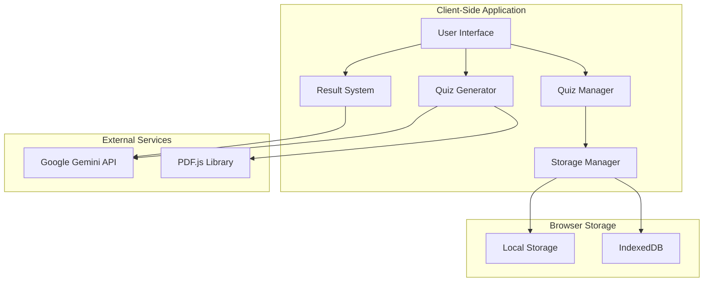

# Design Document

## Overview

The Quiz Platform is a client-side web application built with modern web technologies that can be deployed on static hosting services like GitHub Pages. The platform leverages free AI APIs for quiz generation and explanation features while using browser-based storage for data persistence. The architecture prioritizes cost-effectiveness, offline capability where possible, and responsive user experience.

## Architecture

### High-Level Architecture



### Technology Stack

- **Frontend Framework**: Vanilla JavaScript with modern ES6+ features or lightweight framework (React/Vue.js)
- **Styling**: CSS3 with responsive design, possibly Tailwind CSS
- **PDF Processing**: PDF.js for client-side PDF text extraction
- **AI Integration**: Google Gemini API (free tier)
- **Storage**: Browser LocalStorage and IndexedDB
- **Build Tool**: Vite or Webpack for development and deployment
- **Hosting**: GitHub Pages or similar static hosting

## Components and Interfaces

### 1. Quiz Manager Component

**Responsibilities:**
- Quiz CRUD operations
- Quiz execution and navigation
- Question rendering based on type

**Key Methods:**
```javascript
class QuizManager {
    createQuiz(quizData)
    updateQuiz(quizId, updates)
    deleteQuiz(quizId)
    startQuiz(quizId)
    submitAnswer(questionId, answer)
    calculateResults()
}
```

### 2. Quiz Generator Component

**Responsibilities:**
- PDF text extraction using PDF.js
- AI-powered quiz generation via Gemini API
- Content processing and question formatting

**Key Methods:**
```javascript
class QuizGenerator {
    extractTextFromPDF(pdfFile)
    generateQuizFromText(content, options)
    processAIResponse(response)
    createQuestionsFromContent(content)
}
```

### 3. Question Types

**Multiple Choice Single:**
```javascript
{
    id: string,
    type: 'mcq-single',
    question: string,
    options: string[],
    correctAnswer: number,
    explanation: string,
    media?: { type: 'image', url: string }
}
```

**Multiple Choice Multiple:**
```javascript
{
    id: string,
    type: 'mcq-multiple',
    question: string,
    options: string[],
    correctAnswers: number[],
    explanation: string,
    media?: { type: 'image', url: string }
}
```

**Text Input:**
```javascript
{
    id: string,
    type: 'text-input',
    question: string,
    correctAnswer: string,
    caseSensitive: boolean,
    explanation: string,
    media?: { type: 'image', url: string }
}
```

### 4. Storage Manager Component

**Responsibilities:**
- Data persistence using browser storage
- Quiz and result data management
- API key storage and management

**Storage Strategy:**
- **LocalStorage**: User preferences, API keys, small configuration data
- **IndexedDB**: Quiz data, results, media files (base64 encoded images)

### 5. AI Integration Service

**Responsibilities:**
- Gemini API communication
- Rate limit management
- Error handling and fallbacks

**Key Features:**
- API key validation
- Request queuing for rate limit compliance
- Offline fallback messages
- Prompt engineering for educational content

## Data Models

### Quiz Model
```javascript
{
    id: string,
    title: string,
    description: string,
    questions: Question[],
    createdAt: Date,
    updatedAt: Date,
    settings: {
        shuffleQuestions: boolean,
        showExplanations: boolean,
        timeLimit?: number
    }
}
```

### Result Model
```javascript
{
    id: string,
    quizId: string,
    userId: string, // generated client-side
    score: number,
    totalQuestions: number,
    answers: {
        questionId: string,
        userAnswer: any,
        isCorrect: boolean,
        explanation: string
    }[],
    completedAt: Date,
    timeSpent: number
}
```

### User Preferences Model
```javascript
{
    apiKeys: {
        gemini?: string
    },
    preferences: {
        theme: 'light' | 'dark',
        defaultQuizSettings: object
    }
}
```

## Error Handling

### API Error Handling
1. **Rate Limit Exceeded**: Queue requests and retry with exponential backoff
2. **API Key Invalid**: Prompt user to update API key
3. **Network Errors**: Show offline message and cache requests for retry
4. **AI Response Parsing**: Validate and sanitize AI-generated content

### Client-Side Error Handling
1. **Storage Quota Exceeded**: Implement data cleanup strategies
2. **PDF Processing Errors**: Show user-friendly error messages
3. **Invalid Quiz Data**: Validate and sanitize user inputs
4. **Browser Compatibility**: Provide fallbacks for older browsers

## Testing Strategy

### Unit Testing
- Quiz logic and scoring algorithms
- Data validation and sanitization
- Storage operations
- Question type rendering

### Integration Testing
- AI API integration with mock responses
- PDF processing with sample documents
- End-to-end quiz taking flow
- Data persistence across browser sessions

### User Acceptance Testing
- Quiz creation workflow
- AI-generated quiz quality
- Mobile responsiveness
- Cross-browser compatibility

## AI Prompt Engineering

### Quiz Generation Prompt Template
```
You are an educational AI assistant. Generate a quiz based on the following study material.

Requirements:
- Create [X] questions of mixed types (multiple choice single, multiple choice multiple, text input)
- Ensure questions test understanding, not just memorization
- Provide clear, educational explanations for each answer
- Make questions progressively challenging
- Focus on key concepts and important details

Study Material:
[CONTENT]

Output Format: JSON with questions array containing question objects with type, question, options (if applicable), correctAnswer(s), and explanation fields.
```

### Explanation Generation Prompt Template
```
You are an educational tutor. Provide a clear, helpful explanation for why the correct answer is right and why the user's answer was incorrect (if applicable).

Question: [QUESTION]
Correct Answer: [CORRECT_ANSWER]
User Answer: [USER_ANSWER]
Context: [ORIGINAL_STUDY_MATERIAL_EXCERPT]

Provide a concise but thorough explanation that helps the student understand the concept.
```

## Security Considerations

### API Key Management
- Store API keys in browser's secure storage
- Never expose API keys in client-side code
- Allow users to input their own keys
- Provide clear instructions for obtaining free API keys

### Data Privacy
- All data stored locally in user's browser
- No server-side data collection
- Clear data export/import functionality
- User control over data deletion

### Content Validation
- Sanitize AI-generated content
- Validate quiz data structure
- Prevent XSS through proper content rendering
- Limit file upload sizes and types

## Performance Optimization

### Client-Side Optimization
- Lazy loading of quiz components
- Image compression and caching
- Efficient IndexedDB queries
- Debounced API calls

### API Usage Optimization
- Batch multiple questions in single API call when possible
- Cache AI responses for similar content
- Implement request deduplication
- Use streaming responses for large content processing

## Deployment Strategy

### Build Process
1. Bundle and minify JavaScript/CSS
2. Optimize images and assets
3. Generate service worker for offline capability
4. Create deployment-ready static files

### GitHub Pages Deployment
1. Configure build workflow with GitHub Actions
2. Deploy to gh-pages branch
3. Set up custom domain if desired
4. Enable HTTPS and security headers

### Progressive Web App Features
- Service worker for offline quiz taking
- App manifest for mobile installation
- Background sync for API requests
- Push notifications for study reminders (optional)